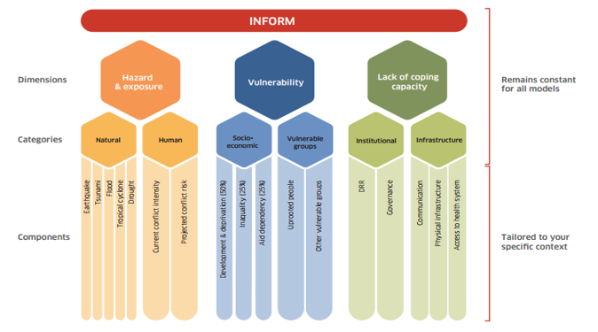
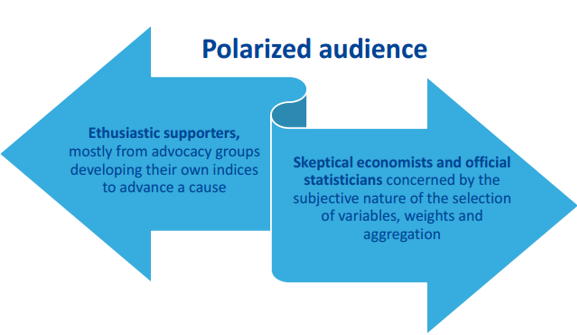
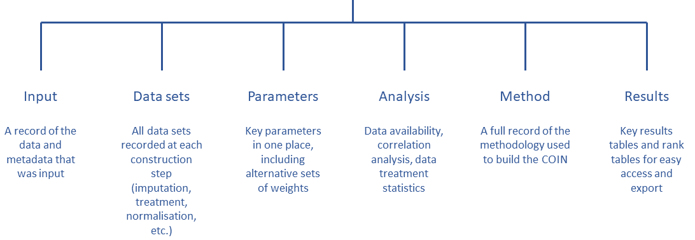

layout: true

<div class="my-footer"><span></span></div> 


```{r setup, include=FALSE}
options(htmltools.dir.version = FALSE)
library(knitr)
# https://github.com/yihui/xaringan/issues/293
options(htmltools.dir.version = FALSE, 
        htmltools.preserve.raw = FALSE,
        tibble.width = 60)

knitr::opts_chunk$set(cache = TRUE, 
                      warning = FALSE, 
                      message = FALSE, 
                      dpi = 180,
                      fig.retina = 3,
                      fig.width = 6,
                      fig.asp = 0.618,
                      fig.show = 'hold', 
                      external = TRUE, 
                      dev = 'svglite'
                      )

#'UNHCR / Americas Bureau /DIMA  <br> <a href="http://github.com/unhcr-americas"><i class="fa fa-github fa-fw"></i>&nbsp; unhcr-americas</a><br> <br><br> See previous Slides available at <https://unhcr-americas.github.io/reproducibility> <br>'

```

---

# Humanitarian Severity Index


.pull-left[

Humanitarian response actors evaluate crisis severity through one consolidated index or multiple sectoral indices.

Each index acts as a metric to quantify and to compare the situation of different admin units within a country. 

Crisis severity is indeed a complex, multi-factorial construct 


CHALLENGE: Summarising and __condensing__ the information of a plurality of underlying indicators into a single measure, in a way that __accurately__ reflects the underlying concept

 
]

 
.pull-right[
 
Example from JRC Global [INFORM]((http://www.inform-index.org)), an index designed to assess humanitarian risks for 191 countries at the national level. 


  


]

???
Depending on the pace of the group, if we do not finish today we will org anise a second session 


---
class: inverse, left, middle

# Aid organisations and donors commit to...

See grand bargain Commitment #5: [Improve joint and impartial needs assessments](https://interagencystandingcommittee.org/improve-joint-and-impartial-needs-assessments)

>  Dedicate resources and involve independent specialists within the clusters to strengthen [..] analysis in a __fully transparent__, collaborative process, which includes a brief summary of the methodological and analytical limitations of the assessment.


???

Notes -


---


## The risk with not statistically-sound index 
 
> "_And so we end up relying on a lot of expert judgment, which in effect means that we’re faking it--we have a process and looks like it’s very rigorous, and in the end is just being done by people’s...assumptions._"

.pull-left[

Conceptual and statistical flaws in the calculation of Humanitarian Severity can greatly limit its usefulness
 
 * Are indicators correctly depicting the severity?
 
 * Are all indicators "really useful" to the final measurement?
  
 * Does the way the indicators are 'assembled" together correctly reflect their true respective importance?

 * Can the methodology be fully __positively audited__?
 
]

 
.pull-right[

 


]


 


???
Composite indicators are developed to address the challenge that comes with the aggregation of heterogeneous information. They are developed to convey consistent policy messages
Because of their very nature, composite indicators cannot be validated versus a ground truth and are always a compromise and as a result tends to create polarized audiences.

Some cons:
Composite indicators may send misleading, non-robust policy messages if they are poorly constructed or misinterpreted. Sensitivity analysis can be used to test composite indicators for robustness.
The simple “big picture” results which composite indicators show may invite politicians to draw simplistic policy conclusions. Composite indicators should be used in combination with the sub-indicators to draw sophisticated policy conclusions.
The construction of composite indicators involves stages where judgement has to be made: the selection of sub-indicators, choice of model, weighting indicators and treatment of missing values etc. These judgements should be transparent and based on sound statistical principles.

Notes - Composite indicators typically seek to reduce distinct quality measures into a single summary indicator. The methods underlying such simplifications should be clear and transparent. Too often, however, composite indicators are presented with limited or no information about the derivation and interpretation of constituent measures. The technical information required to understand how composite indicators were designed is sometimes not published5 or is not reported alongside the actual composite indicator. Some measures are used without clear conceptual justification

A key assumption underlying the use of composite indicators is that the constituent parts together give a fair summary of the whole

Many composite indicator schemes apply threshold-based classification rules to standardise disparate individual measures to a consistent scale. Measures that are naturally continuous are mapped to categorical bands before being combined into the overall composite

The weighting assigned to individual measures contributing to composites is another problem area. As few hospitals perform equally well in all areas, performance can be artificially improved by giving higher weight to individual measures where a hospital performs better than average and vice versa. The choice of weights given to individual measures is thus a key determinant of performance on the overall composite, and different weights might allow almost any rank to be achieved.31 32 Therefore, transparency is needed about the importance attached to each measure in terms of the aim of the indicator, with supporting evidence. However, many schemes do not provide explicit justification for the weights used to create the composite 

https://www.medrxiv.org/content/10.1101/2020.12.08.20246256v1.full 

https://qualitysafety.bmj.com/content/28/4/338 
 

---
class: left, middle

# Learning objectives

This session is a tutorial to show you how to go through each steps required to do the calculation correctly.

### Stage 0. Prepare data & information
### Stage 1. Review & Process data
### Stage 2. Question the  assumptions
### Stage 3. Visualize Results
 


???
Depending on the pace of the group, if we do not finish today we will org anise a second session 

---

# Webinar rules

<i class="fa fa-spinner fa-spin fa-fw fa-2x"></i> Leverage this opportunity and make this session __lively__ - there's no stupid questions!

<i class="fa fa-check-square fa-fw fa-2x"></i> Use the __chat__ to send your questions - we are two facilitators and one is focused on replying all questions directly in the chat while the session is on-going

<i class="fa fa-pencil  fa-fw fa-2x"></i> No need to take notes, all the session __content__ will be shared 

<i class="fa fa-cog fa-fw fa-2x"></i> All practical exercises are designed to get you __testing the commands__:

> Login on a dedicated cloud-based version of RStudio with base packages pre-installed for this session @ 
    
> Paste the command from the chat to your online Rstudio session and check what is happening
    
> In case it is not working as expected, share screenshot or error messages from the console in the chat


---

## Follow the recipe


.pull-left[

In the development area,  there has been long focus to improve the quality of index through methodology nd user guide such as 
[Handbook on Constructing Composite Indicators](https://www.oecd.org/sdd/42495745.pdf), the  [Ten Step Guide](https://knowledge4policy.ec.europa.eu/publication/your-10-step-pocket-guide-composite-indicators-scoreboards_en) & the [pocket Guide](https://knowledge4policy.ec.europa.eu/sites/default/files/10-step-pocket-guide-to-composite-indicators-and-scoreboards.pdf) .  

To bring in the humanitarian world, the same level of statistical quality than in development (aka making the "__nexus__"), the following steps are required: 

 * Treat the data (missing value, outliers)
 * Explore the correlations
 * Standardize/normalize the data
 * Define the weight of each indicator
 * Develop an aggregation method
 * Assess robustness & sensitivity


 
]

 
.pull-right[
 
  


]

???

Notes -

---

### The COIN Object

A dedicated package, [COINr](https://bluefoxr.github.io/COINrDoc) has been created by the European Joint Research center to facilitate the creation of composite indicators. it includes __all steps & components__ to support the process.

  


???

Notes -
* `.$Input` is all input data and metadata that was initially used to construct the COIN.
* `.$Data` consists of data frames of indicator data at each construction step, e.g. `.$Data$Raw` is the raw data used to construct the COIN, `.$Data$Normalised` is the same data set after normalisation, and so on.
* `.$Parameters` contains parameters such as sets of weights, details on the number of indicators, aggregation levels, etc.
* `.$Method` is a record of the methodology applied to build the COIN. In practice, this records all the inputs to any COINr functions applied in building the COIN, for example the normalisation method and parameters, data treatment specifications, and so on. Apart from keeping a record of the construction, this also allows the entire results to be regenerated using the information stored in the COIN. This will be explained better in [Adjustments and comparisons].
* `.$Analysis` contains any analysis tables which are sorted by the data sets to which they are applied. This can be e.g. indicator statistics of any of the data sets found in `.$Data`, or correlations.
* `.$Results` contains summary tables of results, arranged and sorted for easy viewing.

 
---
class: inverse, left, middle

# Stage 0. Prepare data & information


 * Document metadata
 * Specify Hierarchy
 * Organise data in tabular format


---

## Indicator data 

 

Each row is an observation and each column is a variable:

* `UnitName`: name of each unit of observation: municipality, province or whatever admin level used to measure severity.
* `UnitCode`: unique code assigned to each unit (ideally pcode as registered in HDX). This can be then used to facilitate map creation
* `Year` Optional information to provide the reference year of the data. 
* Any column names that begin with `Den_*` are recognized as *denominators*, i.e. indicators that are used to scale other indicators with the `denominate()` function.
* Any column name that starts with `Group_*` is recognized as a group column rather than an indicator. This is optional and some charts also recognize groups.
* Any column that begins with `x_*` will be ignored and passed through. This is useful for e.g. alternative codes or other variables that you want to retain. 
 
 

???

Notes -


*Any remaining columns that do not begin with `x_` or use the other names in this list are recognised as indicators.*

You will notice that all column (variable/indicator) names use short codes. This is to keep things concise in tables, rough plots etc. Indicator codes should be short, but informative enough that you know which indicator it refers to (e.g. "Ind1" is not so helpful). In some COINr plots, codes are displayed, so you might want to take that into account. In any case, the full names of indicators, and other details, are also specified in the indicator metadata table - see the next section.

Some important rules and tips to keep in mind are:

* The following columns are *required*. All other columns are optional (they can be excluded):
  - UnitCode
  - UnitName (if you don't have separate names you can just replicate the unit codes)
  - At least one indicator column
* Columns don't have to be in any particular order, columns are identified by names rather than positions.
* You can have as many indicators and units as you like.
* Indicator codes and unit codes must have unique names. You can't use the same code twice otherwise bad things will happen.
* Avoid any accented characters or basically any characters outside of English - this can sometimes cause trouble with encoding.
* Column names are case-sensitive. Most things in COINr are built to have a degree of flexibility where possible, but *column names need to be written exactly as they appear here for COINr to recognise them*.,


---

## Document Indicators: 


Indicator metadata

* `IndName`: Full name of the indicator, which will be used in display plots.
* `IndCode`: Reference unique code for each indicator. 
* `Direction`: takes values of either 1 or -1 for each indicator. A value of 1 means that higher values of the indicator correspond to higher values of the index, whereas -1 means the opposite.
* `IndWeight`: initial weights assigned to each indicator. Weights are relative within each aggregation group and do not need to sum to one (they will be re-scaled to sum to one within each group).
* `Denominator`: indicator codes of one of the denominator variables for each indicator to be denominated. E.g. here "Den_Pop" specifies that the indicator should be denominated by the "Den_Pop" indicators (population, in this case). For any indicators that do not need denominating, just set `NA`. 
* `IndUnit`: helps for keeping track of what the numbers actually mean, and can be used in plots.
* `Target`:  Optional information used if the normalisation method is distance-to-target.
* Any column name that begins with `Agg` is recognised as a column specifying the aggregation group, and therefore the structure of the index. Aggregation columns *should be in the order of the aggregation*, but otherwise can have arbitrary names.


???

Notes -


* `IndName` [**required**] This is the full name of the indicator, which will be used in display plots.
* `IndCode`[**required**] A reference code for each indicator. These *must be the same codes as specified in the indicator metadata*. The codes must also be unique.
* `Direction` [**required**] The "direction" of each indicator - this takes values of either 1 or -1 for each indicator. A value of 1 means that higher values of the indicator correspond to higher values of the index, whereas -1 means the opposite.
* `IndWeight` [**required**] The initial weights assigned to each indicator. Weights are relative within each aggregation group and do not need to sum to one (they will be re-scaled to sum to one within each group by COINr).
* `Denominator` [**optional**] These should be the indicator codes of one of the denominator variables for each indicator to be denominated. E.g. here "Den_Pop" specifies that the indicator should be denominated by the "Den_Pop" indicators (population, in this case). For any indicators that do not need denominating, just set `NA`. Denominators can also be specified later, so if you want you can leave this column out. See [Denomination] for more information.
* `IndUnit` [**optional**] The units of the indicator. This helps for keeping track of what the numbers actually mean, and can be used in plots.
* `Target` [**optional**] Targets associated with each indicator. Here, artificial targets have been generated which are 95% of the maximum score (accounting for the direction of the indicator). These are only used if the normalisation method is distance-to-target.
* `Agg*` [**required**] Any column name that begins with `Agg` is recognised as a column specifying the aggregation group, and therefore the structure of the index. Aggregation columns *should be in the order of the aggregation*, but otherwise can have arbitrary names.


---


## Describe dimensions and nested levels: 

Aggregation metadata: This data frame simply consists of four columns, all of which are required for assembly:

* `AgLevel`: aggregation level (where 1 is indicator level, 2 is the first aggregation level, and so on 
* `Code`: aggregation group codes must match the codes in the corresponding column in the indicator metadata aggregation columns.
* `Name`: The aggregation group names.
* `Weight`: aggregation group weights, that can be changed later on if needed.

???

Notes -

This data frame simply consists of four columns, all of which are required for assembly:

* `AgLevel` [**required**] The aggregation level (where 1 is indicator level, 2 is the first aggregation level, and so on -- see Section \@ref(Sec:ContructingCIs))
* `Code` [**required**] The aggregation group codes. These codes must match the codes in the corresponding column in the indicator metadata aggregation columns.
* `Name` [**required**] The aggregation group names.
* `Weight` [**required**] The aggregation group weights. These weights can be changed later on if needed.

The codes specified here must be unique and not coincide with any other codes used for defining units or indicators. All columns are required, but do not need to be in a particular order.


---


## Load data and assemble

.pull-left[
To build a composite indicator,  we need three data frames, prepared and assembled in Excel according to a specific format with predefined column name:

1. Indicator data
2. Indicator metadata (_as described previously_)
3. Aggregation metadata (_as described previously_)

```{r, collapse=T}
library(dplyr)
library(COINr)
library(reactable)
library(magrittr)
# install ggbiplot if you don't have it
# library(devtools)
# install_github("vqv/ggbiplot")
library(ggbiplot)

ASEM <- assemble(IndData = ASEMIndData,
                 IndMeta = ASEMIndMeta,
                 AggMeta = ASEMAggMeta)
``` 
]

--

.pull-right[

Apart from building the COIN, `assemble()` does a few other things:

* It checks that indicator codes are consistent between indicator data and indicator metadata
* It checks that required columns, such as indicator codes, are present
* It returns some basic information about the data that was input, such as the number of indicators, the number of units, the number of aggregation levels and the groups in each level. This is done so you can check what you have entered, and that it agrees with your expectations.


]

???

Notes -

 

---
class: inverse, left, middle

# Stage 1. Review & Process data

  1. Indicator statistics 
  
  2. Missing data
  
  3. Denominator
  
  4. Outliers
  
  5. Normalisation
  
  6. Aggregation


---

## Check the indicator statistics


.pull-left[
 
It is advisable to do this both on the raw data, and the normalised/aggregated data.
 

Particular things of interest : 
 * whether indicators or aggregates are highly skewed, 
 * the percentage of missing data for each indicator, 
 * the percentage of unique values, low data availability and zeroes, 
 * the presence of correlations with denominators, and negative correlations 
 
```{r , comment='#', eval=FALSE}
# We can change thresholds for flagging outliers and high/low correlations.
ASEM <- getStats(ASEM, dset = "Raw")

names(ASEM$Analysis$Raw$StatTable)

# view stats within a table
ASEM$Analysis$Raw$StatTable %>%
  roundDF() %>%
  reactable()
``` 
 
]

--

.pull-right[

Example: 
```{r , echo=FALSE, dev='ragg_png', dpi=300}
# We can change thresholds for flagging outliers and high/low correlations.
ASEM <- getStats(ASEM, dset = "Raw")
# view stats within a table
stat <- ASEM$Analysis$Raw$StatTable

stat %>%
  roundDF() %>%
  head( 6) %>%
  select(Indicator, Skew, Kurtosis, Prc.complete, SK.outlier.flag  ) %>%
  reactable()
```
]


???


Notes - Apart from the overall statistics for each indicator, `getStats` also returns a few other things:

* `.$Outliers`, which flags individual outlying points using the relation to the interquartile range
* `.$Correlations`, which gives a correlation matrix between all indicators in the data set
* `.$DenomCorrelations`, which gives the correlations between indicators and any denominators

At this point you may decide to check individual indicators, and some may be added or excluded.

---

## View missing data by group

.left-column[

```{r ,eval=FALSE}
ASEM <- checkData(ASEM, dset = "Raw")

#names(ASEM$Analysis$Raw$MissDatByGroup)
ASEM$Analysis$Raw$MissDatByGroup %>%
  reactable::reactable()
``` 
]

.right-column[

Example: 
```{r echo=FALSE, message=FALSE, warning=FALSE}
ASEM <- checkData(ASEM, dset = "Raw")
missing <- ASEM$Analysis$Raw$MissDatByGroup 
missing %>%
  head( 6) %>%
  select(head(names(ASEM$Analysis$Raw$MissDatByGroup),5))%>%
  reactable::reactable()
``` 

]


---


## Add Denomination 


.pull-left[
 

To be able to compare small countries with larger ones, you may need to divide indicators by e.g. GDP or population , you can use `denominate()`. The specifications are either made initially in `IndMeta`, or as arguments to `denominate()`. In the case of the ASEM data set, these are included in `IndMeta` so the command is very simple (run `View(ASEMIndMeta)` to see). We will afterwards check the new stats to see what has changed. 


```{r, eval=FALSE}
# create denominated data set
ASEM <- denominate(ASEM, dset = "Raw")

# get stats of denominated data
ASEM <- getStats(ASEM, dset = "Denominated")

# view stats table
ASEM$Analysis$Raw$StatTable %>%
  reactable()
``` 

]

.pull-right[

```{r, fig.width=4,  echo=FALSE, dev='ragg_png', dpi=300}
# create denominated data set
ASEM <- denominate(ASEM, dset = "Raw")

# get stats of denominated data
ASEM <- getStats(ASEM, dset = "Denominated")

# view stats table
denom <- ASEM$Analysis$Raw$StatTable
denom  %>%  
  reactable()
``` 

]


???

Notes -According to the new table, there are now no high correlations with denominators, which indicates some kind of success.

---


## Treat the data for outliers


.pull-left[
 

Standard approach which Winsorises each indicator up to a specified limit of points, in order to bring skew and kurtosis below specified thresholds. If Winsorisation fails, it applies a log transformation or similar.Following treatment, it is a good idea to check which indicators were treated and how:

```{r, eval=FALSE}
ASEM <- treat(ASEM, 
              dset = "Denominated", 
              winmax = 5)
ASEM$Analysis$Treated$TreatSummary %>%
  filter(Treatment != "None") %>%
  reactable()

``` 
]

.pull-right[
 
```{r Treat, echo=FALSE}
ASEM <- treat(ASEM, 
              dset = "Denominated", 
              winmax = 5)

treat <- ASEM$Analysis$Treated$TreatSummary 
treat %>%
  filter(Treatment != "None") %>% 
  head( 5) %>%
  reactable()
```


]


???

Notes -

---


## Visualise effect of data treatment


.left-column[
 
Effect of the Winsorisation can be plotted using box plots or violin plots. 

```{r , eval=FALSE}
COINr::iplotIndDist2(ASEM, 
  dsets = c("Denominated", "Treated"), 
  icodes = "Services", 
  ptype = "Scatter")
``` 
]
.right-column[


```{r Winsorisation, fig.width=2,   echo=FALSE, dev='ragg_png', dpi=300}
COINr::iplotIndDist2(ASEM, 
              dsets = c("Denominated", "Treated"), 
              icodes = "Services", 
              ptype = "Scatter")
``` 

]


???

Notes -It is also a good idea to visualise and compare the treated data against the untreated data. The best way to do this interactively is to call `indDash()` again, which allows comparison of treated and untreated indicators side by side. 

---


## Normalise the data 


.left-column[

Normalisation is the operation of bringing indicators onto comparable scales so that they can be aggregated more fairly. This is done by setting `ntype`

```{r}
ASEM <- normalise(ASEM, 
                  dset = "Treated", 
                  ntype = "minmax", 
                  npara = list(minmax = c(0,100)))
```

]

.right-column[
*  `minmax` min-max transformation that scales each indicator onto an interval specified by `npara`, e.g. if `npara$minmax = c(0,10)` the indicators will scale to [0, 10].
* `zscore` scales the indicator to have a mean and standard deviation specified by `npara`, e.g. if `npara$zscore = c(0,1)` the indicator will have mean zero and standard deviation 1.
* `scaled` is a general linear transformation defined by `npara$scaled = c(a,b)` which subtracts `a` and divides by `b`.
* `goalposts` is a capped linear transformation with `npara$goalposts = c(l, u, a)`, where `l` is the lower bound, `u` is the upper bound, and `a` is a scaling parameter.
* `rank` replaces indicator scores with their corresponding ranks, such that the highest scores have the largest rank values. Ties take average rank values. Here `npara` is not used.
* `borda` is similar to `rank` but uses Borda scores, which are simply rank values minus one. 
* `prank` gives percentile ranks. 
* `fracmax` scales each indicator by dividing the value by the maximum value of the indicator. 
* `dist2ref` gives the distance to a reference unit, defined by `npara`, `dist2max` gives the normalised distance to the maximum of each indicator and  `dist2targ` gives the normalised distance to indicator targets. Any scores that exceed the target will be capped at a normalised value of one.


]


???

Notes -Again, we could visualise and check stats here but to keep things shorter we'll skip that for now.
* `custom` allows to pass a custom function to apply to every indicator. For example, `npara$custom = function(x) {x/max(x, na.rm = T)}` would give the "fracmax" normalisation method described above.
* `none` the indicator is not normalised (this is mainly useful for adjustments and sensitivity analysis).
---


## Aggregation of all indicators: which method to use?


.left-column[
Aggregation type can be done at multiple stage and through the  `agtype` setting

```{r}
ASEM <- aggregate(ASEM, 
                  agtype = "arith_mean", 
                  dset = "Normalised")

``` 
 

]


.right-column[
The main options are: 
 * `arith_mean` The most straightforward and widely-used approach to aggregation is the **weighted arithmetic mean**.
 
 * `geom_mean` the **weighted geometric mean** uses the product of the indicators rather than the sum

 * `harm_mean` The [Pythagorean means](https://en.wikipedia.org/wiki/Pythagorean_means) also called **weighted harmonic mean**,  uses the mean of the reciprocals of the indicators. It is the the least compensatory of the the three means, even less so than the geometric mean. It is often used for taking the mean of rates and ratios.

 * `median` The *weighted median* is defined by ordering indicator values, then picking the value which has half of the assigned weight above it, and half below it.

 * `copeland` The [Copeland method](https://en.wikipedia.org/wiki/Copeland%27s_method) is based pairwise comparisons between units, calculated from an *outranking matrix* 
]
 


???

Notes -

---
class: inverse, left, middle

# Stage 2. Question the  assumptions


* Correlations between indicators,  with parents pillars,  within and between pillars
* Internal Consistency
* Principle component
* Effect of specific formulation
* Sensitivity Analysis

???

correlation structure between the underlying indicators and its effect on the overall score (i.e., the CI). Ideally, there should be positive correlations between the indicators as this indicates that individual variables are linked to an overarching concept


---

## Reconstruct the index from raw data 


.pull-left[

to check differences, Check calculations for pre-aggregated data to make sure that they are correct. If you only have normalised and aggregated data, you can still at least check the aggregation stage as follows. Assuming that the indicator columns in your pre-aggregated data are normalised, we can first manually create a normalised data set: 
]

--

.pull-right[


```{r, message=FALSE}
# extract aggregated data set (as a data frame)
Aggregated_Data <- ASEM$Data$Aggregated

# assemble new COIN only including pre-aggregated data
ASEM_preagg <- assemble(IndData = Aggregated_Data,
                        IndMeta = ASEMIndMeta,
                        AggMeta = ASEMAggMeta,
                        preagg = TRUE)
```

```{r}
ASEM_preagg$Data$Normalised <- ASEM_preagg$Data$PreAggregated %>%
  select(!ASEM$Input$AggMeta$Code)
```

Here we have just copied the pre-aggregated data, but removed any aggregation columns.

Next, we can aggregate these columns using COINr.

```{r}
ASEM_preagg <- aggregate(ASEM_preagg, 
                         dset = "Normalised", 
                         agtype = "arith_mean")

# check data set names
names(ASEM_preagg$Data)
```

]

???

Notes - COINr will check that the column names in the indicator data correspond to the codes supplied in the `IndMeta` and `AggMeta`. This means that these two latter data frames still need to be supplied. However, from this point the COIN functions as any other, although consider that it cannot be regenerated (the methodology to arrive at the pre-aggregated data is unknown), and the only data set present is the "PreAggregated" data.

---

## Check whether  data frames are the same 


.pull-left[
 

Double-checking calculations is tedious but in the process you often learn a lot.  
]

--

.pull-right[

```{r}
all_equal(ASEM_preagg$Data$PreAggregated,
          ASEM_preagg$Data$Aggregated)
```

]


???

Notes - As expected, here the results are the same. If the results are *not* the same, `all_equal()` will give some information about the differences. If you reconstruct the index from raw data, and you find differences, a few points are worth considering:

1. The difference could be due to an error in the pre-aggregated data, or even a bug in COINr. If you suspect the latter please open an issue on the repo.
2. If you have used data treatment or imputation, differences can easily arise. One reason is that some things are possible to calculate in different ways. COINr uses certain choices, but other choices are also valid. Examples of this include:
    - Skew and kurtosis (underlying data treatment) - see e.g. `?e1071::skewness`
    - Correlation and treatment of missing values - see `?cor`
    - Ranks and how to handle ties - see `?rank`
3. Errors can also arise from how you entered the data. Worth re-checking all that as well.


---


## Revise internal consistency 

Cronbach's alpha calculation should be done for any group of indicators 
```{r}
# all indicators
getCronbach(ASEM, dset = "Normalised")

# indicators in connectivity sub-index
getCronbach(ASEM, dset = "Normalised", icodes = "Conn", aglev = 1)

# indicators in sustainability sub-index
getCronbach(ASEM, dset = "Normalised", icodes = "Sust", aglev = 1)

# pillars in connectivity sub-index
getCronbach(ASEM, dset = "Aggregated", icodes = "Conn", aglev = 2)

# pillars in sustainability sub-index
getCronbach(ASEM, dset = "Aggregated", icodes = "Sust", aglev = 2)
```
???

Notes -Recall here that because we have plotted a "Raw" indicator against the index, and this is a negative indicator, its direction is flipped. Meaning that in this plot there is a positive correlation, but plotting the normalised indicator against the index would show a negative correlation.

---


## Correlation analysis on the normalised data 


.left-column[
 

As indicators have had their directions reversed where appropriate, how the consistency of the sustainability pillars is then affected? 

```{r , eval=FALSE}
COINr::plotCorr(ASEM, 
        dset = "Aggregated", 
        icodes = "Sust", 
        aglevs = 2, 
        pval = 0)
``` 
]

--

.right-column[


```{r, fig.width=4,   echo=FALSE, dev='ragg_png', dpi=300}
COINr::plotCorr(ASEM, dset = "Aggregated", 
                icodes = "Sust", 
                aglevs = 2, 
                pval = 0)
``` 

]
 

???

Notes - 
Sustainability dimensions are not well-correlated and are in fact slightly negatively correlated. This points to trade-offs between different aspects of sustainable development: as social sustainability increases, environmental sustainability often tends to decrease. Or at best, an increase in one does not really imply an increase in the others.

---


## Principle component analysis 

This can be done only on data without missing value

```{r}


# impute one
ASEM2 <- impute(ASEM, dset = "Denominated", imtype = "indgroup_mean", groupvar = "Group_GDP")
ASEM2 <- normalise(ASEM2, dset = "Treated", ntype = "minmax", npara = list(minmax = c(0,100)))
# try here at the indicator level, let's say within one of the pillar groups:
PCA_P2P <- getPCA(ASEM2, dset = "Normalised", 
                  icodes = "P2P", 
                  aglev = 1, 
                  out2 = "list")

summary(PCA_P2P$PCAresults$P2P$PCAres)
```


```{r}

# ggbiplot(PCA_P2P$PCAresults$P2P$PCAres,
#          labels = ASEM$Data$Normalised$UnitCode,
#          groups = ASEM$Data$Normalised$Group_EurAsia)
```


???

Notes - We can see that the first principle component explains about 50% of the variance of the indicators, which is perhaps borderline for the existence of single latent variable. That said, many composite indicators will not yield strong latent variables in many cases.

We can now produce a PCA biplot using this information.
Once again we see a fairly clear divide between Asia and Europe in terms of P2P connectivity, with exceptions of Singapore which is very well-connected. We also note the small cluster of New Zealand and Australia which have very similar characteristics in P2P connectivity.

---


## Understand the effective weights of each indicator
 
.left-column[

The weight of an indicator in the final index is due to its own weight, plus the weight of all its parents, as well as the number of indicators and aggregates in each group. 

```{r, eval=FALSE}
#  `effectiveWeight()` gives effective weights for all levels. We can check the indicator level by filtering:
EffWts <- effectiveWeight(ASEM)
COINr::plotframework(ASEM)


```
 
]


.right-column[

```{r fig.width=3,  echo=FALSE, dev='ragg_png', dpi=300}
COINr::plotframework(ASEM)

# Filter the maximum and minimum effective weights and which indicators are involved:
# IndWts <- EffWts$EffectiveWeightsList %>%
#   filter(AgLevel == 1) %>%
#   filter(EffectiveWeight %in% c(min(IndWts$EffectiveWeight), max(IndWts$EffectiveWeight)))

```
]


???

Notes - 
A sometimes under-appreciated fact is that ....

For example, an equally-weighted group of two indicators will each have a higher weight (0.5) than an equally weighted group of ten indicators (0.1), and this applies to all aggregation levels. 

---


## What-ifs: Effect of  formulation on scores & ranks 

Examples could include different weights, as well as adding/removing/substituting indicators or entire aggregation groups


```{r}
# Copy the COIN
ASEM_NoPolitical <- ASEM

# Copy the weights
ASEM_NoPolitical$Parameters$Weights$NoPolitical <- ASEM_NoPolitical$Parameters$Weights$Original

# Set Political weight to zero
ASEM_NoPolitical$Parameters$Weights$NoPolitical$Weight[
  ASEM_NoPolitical$Parameters$Weights$NoPolitical$Code == "Political"] <- 0

# Alter methodology to use new weights
ASEM_NoPolitical$Method$aggregate$agweights <- "NoPolitical"

# Regenerate
ASEM_NoPolitical <- regen(ASEM_NoPolitical)
```

Now we need to compare the two alternative indexes:

```{r}
COINr::compTable(ASEM, ASEM_NoPolitical, dset = "Aggregated", isel = "Index",
          COINnames = c("Original", "NoPolitical"))
```
???

Notes - 
1. Use the "exclude" argument of `assemble()` to exclude the relevant indicators
2. Set the weight of the Political pillar to zero
3. Remove the indicators manually

Here we will take the quickest option, which is Option 2.
The results show that the rank changes are not major at the index level, with a maximum shift of six places for Estonia. The implication might be (depending on context) that the inclusion or not of the Political pillar does not have a drastic impact on the results, although one should bear in mind that the changes on lower aggregation levels are probably higher, and the indicators themselves may have value and add legitimacy to the framework. In other words, it is not always just the index that counts.

---


## Sensitivity analysis:  test the overall effect of uncertainties
 

???

Notes -  

---
class: inverse, left, middle

# Stage 3. Visualize Results

* Index
* SubDimensions
* Maps
* Summary
* Export


---

## Index & Sub Dimensions


.left-column[
 

We can now visualize our results. A good way at the index level is a stacked bar chart.

```{r, eval=FALSE}
COINr::iplotBar(ASEM, dset = "Aggregated", 
         isel = "Index", 
         aglev = 4, 
         stack_children = T)
```
 
]

--

.right-column[

```{r fig.width=2,  echo=FALSE, dev='ragg_png', dpi=300}
COINr::iplotBar(ASEM, dset = "Aggregated", 
         isel = "Index", 
         aglev = 4, 
         stack_children = T)
```
]
 
???

Notes -

---


## Sub Indices Interactions

.left-column[
 
 

```{r, eval=FALSE}
COINr::iplotIndDist2(ASEM, 
    dsets = "Aggregated", 
    icodes = "Index")
```
 
]

--

.right-column[

```{r fig.width=2,  echo=FALSE, dev='ragg_png', dpi=300}
COINr::iplotIndDist2(ASEM, 
              dsets = "Aggregated", 
              icodes = "Index")
```
]
 
 
 

???

Notes -

---


## Display the index on a Map

.left-column[

```{r, eval=FALSE}
COINr::iplotMap(ASEM, 
    dset = "Aggregated", 
    isel = "Conn")
```
 
]

--

.right-column[

```{r fig.width=2,  echo=FALSE, dev='ragg_png', dpi=300}
COINr::iplotMap(ASEM, 
                dset = "Aggregated", 
                isel = "Conn")
```
]
 
 

???

Notes -

---


## Present summary table.

```{r}
COINr::getResults(ASEM, tab_type = "Summary") %>%
  head(7)%>%
  knitr::kable()
```


???

Notes -

---


## Export Results

Get tables to present (the highest levels of aggregation are the first columns, rather than the last, and it is sorted by index score).

```{r, eval=F}
# Write full results table to COIN
COINr::getResults(ASEM, tab_type = "FullWithDenoms", out2 = "COIN")

# Export entire COIN to Excel
COINr::coin2Excel(ASEM, "ASEM_results.xlsx")
```

???

Notes -

---
class: inverse, left, middle

# Conclusion. Reproducibility to ensure transparency

 * Strictly Use "curated & published" data for your sub-indicators - Data should be available on HDX / https://data.humdata.org
 
 * Put Code into github to document your process - the data structure required for the packages allows for better discoverability!
 
 * Call for peer and/or independent review to cover yourself! when using scripted reproducible analysis, this should be very quick!!!

